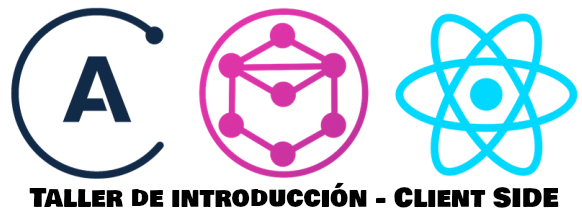

Para el desarrollo de la charla/taller, se recomienda que dispongas de las siguientes herramientas en el equipo informático donde vayas a trabajar:

- Gestor de versiones [Git](https://git-scm.com/), versión 2.7 o superior.
- [NodeJS](https://nodejs.org/es/download/current/), versión 8.0 o superior.
- Navegador web [Google Chrome](https://www.google.es/chrome/browser/desktop/index.html), versión 58.0 o superior.
- Editor de código. Recomendado [Visual Studio Code](https://code.visualstudio.com/)

## Introducción

Este repositorio contiene el código necesario para llevar a cabo un taller introductorio a React y Apollo Client, en el cual se explicará paso a paso como consumir una API GraphQL desde una aplicación React, realizando operaciones CRUD (Create Read Update Delete) mediante queries y mutations.

#### Servidor de datos

Lo primero es descargar el servidor que contiene los datos de las películas que vamos a consumir desde GraphQL. Para ello, debes seguir estos pasos:

```sh
$ git clone https://github.com/canariasjs/jsdaycan2017.dbserver.git db-server
$ cd db-server
$ npm install
$ npm run json_server
```

#### API

Lo seguno es descargar la API que consumirá el servidor de datos, a la cual se conectará nuestro cliente. Para ello, debes seguir estos pasos:

```sh
$ git clone https://github.com/canariasjs/jsdaycan2017.api.git graphql-api
$ cd graphql-api
$ npm install
$ npm start
```

## Organización del taller

Con el servidor de datos, basado en `json-server`, correctamente iniciado y funcionando, así como la API ejecutada y funcionando, empezaremos el taller con una breve presentación que nos permitirá dos cosas:

<<<<<<< HEAD
Hemos añadido stylelint y el stylelint.rc para lintear el codigo sass.

# Paso 1
=======
1. Exponer los conceptos básicos de React y Apollo Client con los que vamos a trabajar.
2. Permitir a aquellas personas que no hayan podido configurar el entorno de trabajo, hacerlo antes de empezar a programar.

Una vez concluída la presentación inicial, comenzaremos a trabajar en el código.

Para asegurar el correcto avance de todas las personas asistentes al taller, el repositorio está organizado en ramas de Git. Estas ramas estarán identificadas como `paso-n` donde `n` indicará el número correspondiente a la fase del proyecto en la que vamos a estar trabajando.

De esta forma, a medida que vayamos avanzando en el proyecto, iremos guardando los cambios que hayamos realizado

```sh
$ git add .
$ git commit -m "el comentario que tu quieras"
```

y a continuación, cambiaremos de rama 

```sh
$ git checkout paso-n
```

de manera que al comienzo de cada nueva fase del taller, todos y todas partamos desde el mismo punto.

Una vez dicho esto, lo que vamos a realizar en cada una de las ramas será lo siguiente:

# Rama master

Esta será la rama de inicio y con su contenido, veremos la distribución inicial del proyecto, contenidos de ficheros, instalación de paquetes necesarios mediante `NPM` así como arrancar el servidor por primera vez y verificar su correcto funcionamiento.

# Rama paso-1
>>>>>>> master

En este paso hemos creado dos tipos de componente:
- Movies: un componente container
- MovieItem: un componente presentacional

Dado que los componentes presentacionales no necesitan tener estado propio,
ya que utilizan los datos que reciben de su container padre y a su vez, ejecutan
funciones de su container padre, se plantea el siguiente ejercicio:

- Refactorizar el componente MovieItem al formato funcional, de forma que será una
  arrow function que recibe props por parámetros y retorna el JSX.

<<<<<<< HEAD
# Paso 2
=======
# Rama paso-2
>>>>>>> master

En este paso crearemos un json con películas mockeadas desde la API GraphQL que serán cargadas desde el container Movies.
Por cada película, mostraremos un componente MovieItem con los datos correspondientes.

Dado que nuestro componente MovieItem solo muestra el título, se plantea el siguiente ejercicio:

- Refactorizar el componente MovieItem para que muestre, además del título, la imagen y el rating.

<<<<<<< HEAD
=======
# Rama paso-3

En este paso añadiremos un router a nuestra aplicación. Para ello crearemos un nuevo container que se encargará 
de mostrar los detalles de una película y el cual recibirá la pelicula en sus props desde el router.

Una vez que tenemos los datos en las props del componente, se plantean los siguientes ejercicios:

- Asociar la pelicula que recibimos por parámetro al state del coponente
- Mostrar en el componente el titulo (h4) y la descripción de la película (p)

# Rama paso-4

En este paso añadiremos un boton en el movies container que nos permite mostrar un modal con un formulario para crear películas.
En movies container controlaremos si el formulario está abierto o cerrado.

El formulario tendrá su propio estado, el cual será las propiedades de una película. Además añadiremos validadores que nos permitan
controlar los datos que el usuario está introduciendo.

Una vez que tenemos el formulario creado y podemos llamarlo desde el movies container, se plantean los siguientes ejercicios:

- Añadir una propiedad rating al formulario para permitir que el usuario valore la película.
- Añadir un validador al formulario que controle que el rating esté entre 0 y 10

# Rama paso-5

En este paso crearemos los botones Edit y Delete en el container movieDetails.
En este container, al igual que en el caso anterior, llamaremos al container movieForm pero esta vez le pasaremos una película por parámetro.
Hemos modificado el componente movieForm para que si recibe una película por parametro, rellene el formulario con los datos de esa película.

Una vez tenemos cargado el movieForm desde movieDetails, y se ha modificado el form para recibir la película. Se plantéa el siguiente ejercicio:

- Envíale por parámetro al MovieForm la película que estas viendo en detalles. El formulario se sobreescribirá con la pelicula que reciba por parámetro en componentWillReceiveProps()

# Rama paso-6

En este paso, modificando el archivo index.js hemos conectado nuestra aplicación con el GraphQL server que tenemos funcionando localmente.

Posteriormente, hemos creado un archivo donde almacenamos todas las queries que vamos a realizar al GraphQL server.

Luego hemos definido nuestra primera query, llamada allMovies. Esta querie obtendrá un array de películas del server y dichas películas
tendrán las propiedades que nosotros hemos especificado en la query.

Por último, hemos conectado nuestro container component a GraphQL para mostrar los datos recibidos de la API en vez de los datos mockeados.

# Rama paso-7


En este paso hemos conectado nuestro container component moviesDetails a GraphQL para obtener los datos de una pelicula especifica desde la API.
Para ello, le pasamos a Apollo el id de la pelicula que queremos obtener.

Dado que en el paso 6 ya viste como se creaba una query, se plantea el siguiente ejercicio:

- Actualiza la query moviesById indicándole que parametros debe de tener la película que devuelve la API.

# Rama paso-8

En este paso hemos conectado nuestro movieForm container component a GraphQL de forma que cuando pulsemos el boton crear de nuestro formulario,
ejecutará una mutation.

La mutation la hemos definido en mutations/movies.js de forma que está lista para recibir los datos que necesitamos y ejecutar la peticion.

Por ultimo, a la hora de exportar el container movieForm hemos definido que tras ejecutar la mutation, ejecutaremos de nuevo la query allMovies para refrescar
automaticamente nuestra lista de películas.

# Rama paso-9

En este paso hemos definido una nueva mutation que nos permitirá actualizar una película.
En el formulario hemos definido otro boton y hemos aplicado una lógica que mostrará el boton crear o el boton actualizar dependiendo de si recibimos una película por
props o no.

Posteriormente, hemos definido la mutation al igual que la anterior y la hemos conectado al container.

Dado que en el paso 8 ya vistes como se define una mutation, se plantea el siguiente ejercicio:
- Actualiza la mutation updateMovie de forma que puedas enviarle a la API los valores que recibes por parámetro desde el componente container.

# Rama paso-10

En este paso hemos definido una nueva mutation que nos permitirá eliminar una película.

Las películas se borrarán desde su vista detalle. Para ello hemos actualizado el container movieDetails creando un boton
que ejecutará el metodo delete, el cual ejecutará la mutation y posteriormente nos llevara a la lista de películas.

A continuación, hemos conectado la mutation al container para que pueda ser ejecutada por este.

Finalmente, hemos actualizado los estilos de la aplicación para hacerla mas agradable visualmente.
>>>>>>> master
